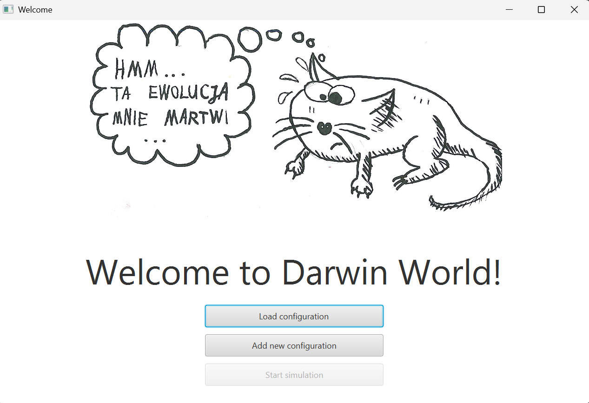
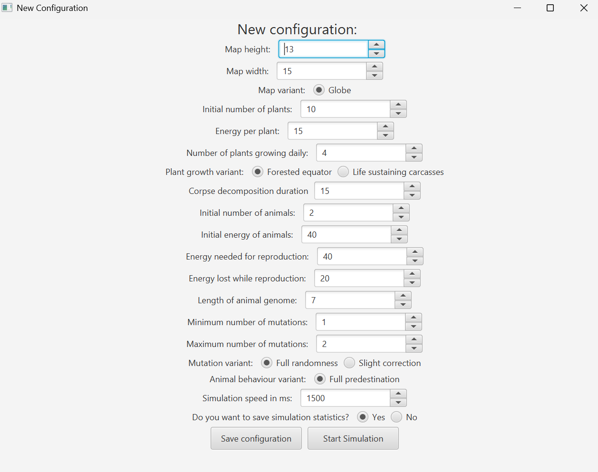
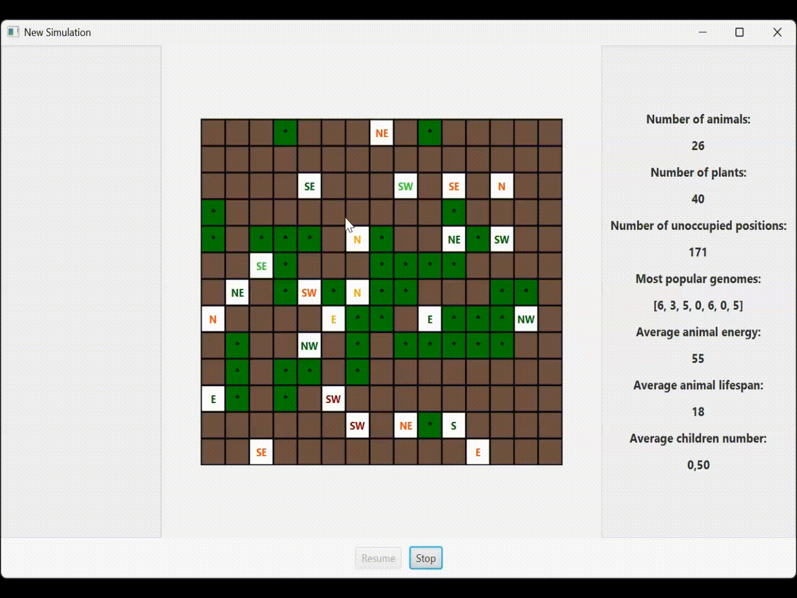

# Darwin World
## Table of contents:
* [General info](#general-info)
* [Usage](#usage)
* [App functionalities](#app-functionalities)
* [Project structure](#project-structure)
* [Requirements](#requirements)
* [Setup](#setup)
### General info
The aim of this project is to create a JavaFX application tha simulates evolution of animals in virtual ecosystem. 
The simulation is driven by parameters provided by user.
The application visualizes the interactions between animals and their world, showing step by step occurring changes.
### Description
Each day's simulation consists of the following steps:
* Removing dead animals from the map.
* Turning and moving each animal.
* Consuming plants.
* Reproduction.
* Growing new plants.

Each animal has N genes, each represented by a number from 0 to 7. These genes define the animal's behavior in a simplified manner. The existence of the animals follows a cyclical nature. Each animal keeps track of which part of its genome it will use on a given day. During movement, the animal first turns based on the currently active gene, then moves one step in the designated direction. The active gene is then deactivated, and the next gene in sequence becomes active for the following day.

Eating is a simple process. An animal consumes a plant when it steps onto its tile, increasing its energy by a predefined amount.

Reproduction occurs only when both parents have sufficient energy. They pass on part of their energy to their offspring, which determines its starting energy. The offspring's genome is a combination of the parents' genes, with proportions based on their energy levels. A crossover point is determined, ensuring that the stronger parent's genes have a greater influence. Random mutations occur, changing some genes to new values.
### App functionalities & Demo
The simulation begins by launching the application, where the user can either select a predefined configuration or customize various parameters to shape the world. Each simulation runs in a separate window, allowing multiple worlds to be observed simultaneously.



The application offers a highly configurable environment.



Once the simulation starts, animals move, feed, reproduce, and evolve based on their genetic traits and environmental conditions. The simulation can be paused at any time, enabling players to track individual animals, analyze their energy levels, offspring count, and survival history. Additionally, dominant genotypes can be highlighted to reveal common genetic patterns among the population. Furthermore, preferred areas for plant growth are also highlighted, providing insight into the ecosystem's natural balance and resource distribution. 
To better understand the ecosystem's dynamics, real-time statistics are available, displaying details such as the total number of animals and plants, available free space, the most dominant genotype, average energy levels. Also, if this was decided, statistics are saved (every day) to a CSV file.



### Project structure
```
agh.ics.poproject/
├── inheritance/         # Contains classes related to reproduction & mutations
│   
├── model/               # Core model components
│   ├── elements/        # Defines world elements like animals & plants
│   │   
│   ├── map/             # Contains classes connected with world map & plant growth methods
│   ├── util/            # Utility classes for visualization
│   
├── presenters/          # UI logic 
│   
├── simulation/          # Simulation logic and statistics tracking
│   
├── util/                # Utility classes for configuration & files handing 
├── SetApp.java          # JavaFX application entry point
├── Main.java            # Main execution entry point

```
### Requirements
* Java **21**
* Gradle (automatically handled via `gradlew`)
* JavaFX **17**
### Setup
1. First, clone this repository.
   ```sh
   git clone https://github.com/natix-x/Darwin-World.git
   ```
2. Go to project directory.
   ```sh
   cd DarwinWorld/PO_PROJECT_2024_STALMACH_WRZESNIAK/
   ```
2. Build the project.
    ```sh
   gradlew build
   ```
3. Run the application
    ```sh
   gradlew run
   ```
### Project Source
[Click here](https://github.com/Soamid/obiektowe-lab/tree/master/proj)
